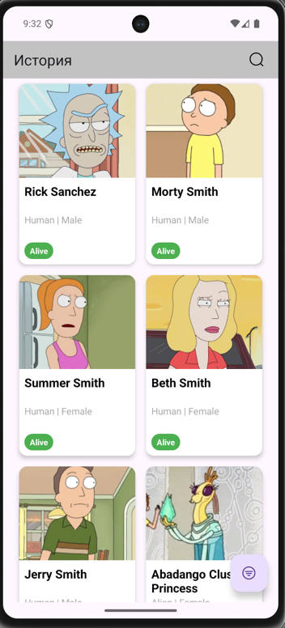
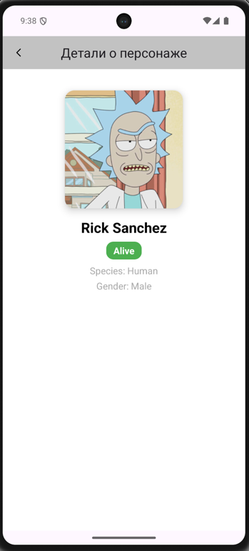

# Rick and Morty App

Приложение, которое отображает персонажей из вселенной **Rick and Morty**.  
Реализовано с использованием **Paging 3**, **MVI**, **Clean Architecture**, **Hilt** и **Retrofit** и **Kotlin**.  
Данные получаются из публичного API: [Rick and Morty API](https://rickandmortyapi.com/).

---

## 🚀 Функционал
- Загрузка списка персонажей с помощью Paging 3
- Поиск по имени, статусу, виду и полу
- Экран деталей персонажа
- Поддержка Pull-to-Refresh
- Обработка ошибок (404, отсутствие сети и т.д.)
- Кэширование данных через Room

---

## 📸 Скриншоты

| Главный экран | Детали персонажа |
|----------------|------------------|
|  |  |

## 🧩 Технологии и стек

| Категория | Используемые технологии                                |
|------------|--------------------------------------------------------|
| Язык | Kotlin                                                 |
| Архитектура | MVI + Clean Architecture                               |
| DI | Hilt                                                   |
| Работа с сетью | Retrofit + OkHttp                                      |
| Загрузка изображений | Glide                                                  |
| База данных | Room                                                   |
| Пагинация | Paging 3                                               |
| UI | XML (RecyclerView, SwipeRefreshLayout) 

---

## 🧠 Архитектура

Проект построен с использованием **многомодульной архитектуры**, основанной на принципах **Clean Architecture** и **MVI**.  
Каждый модуль выполняет свою четкую задачу и изолирован от остальных с помощью зависимостей Gradle.

Структура папок:

├── :app # Точка входа в приложение (навигация, DI, инициализация)
├── :core # Общие утилиты, extensions, логгирование и базовые классы
├── :data # Источники данных (API, Room, репозитории)
├── :domain # Бизнес-логика, use cases, entity-модели
├── :feature:characters # Фича-модуль со списком персонажей (список, фильтрация, поиск)
├── :feature:details # Фича-модуль деталей персонажа
└── :common-ui # Общие UI-компоненты, стили, view elements (ProgressBar, ErrorView и т.д.)